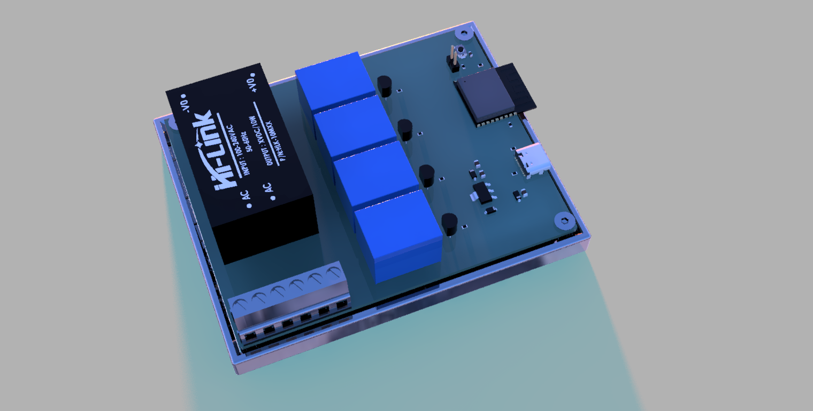
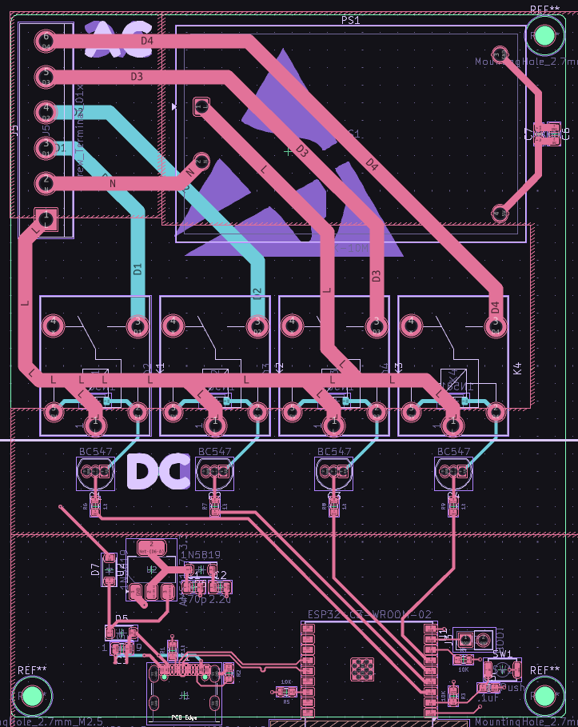

# LazyController

A compact WiFi-enabled relay controller built on a custom PCB. Flip switches, trigger appliances, and automate stuff — all from your phone or browser. No getting up required.

---

## What is it?

LazyController is an IoT relay board designed around an ESP-based microcontroller. It exposes relay outputs over WiFi, letting you remotely toggle lights, fans, pumps, or anything else you'd rather not walk over to.

- Custom PCB with onboard relay(s)
- WiFi control via a web interface or serial commands
- Compact form factor — designed to tuck away somewhere tidy
- Production-ready Gerbers included for ordering straight from JLCPCB/PCBWay

---

## Repository Layout

```
LazyController/
├── Cad/          # Enclosure and assembly CAD files
├── Code/         # Firmware source (code.ino)
├── lib/          # README images/assets
├── Pcb/          # KiCad project files (schematic + PCB)
├── production/   # Manufacturing outputs (BOM, positions, netlist, backups)
└── README.md
```

---

## PCB

The board was designed with simplicity in mind — power in, relay out, WiFi in the middle.

<p align="center">
   
</p>

> PCB layout and schematic are in the `Pcb/` folder.  
> Gerbers for direct upload to your fab of choice are in `production/`.
<p align="center">
   
</p>
**Ordering a board:**
1. Zip the contents of `production/`
2. Upload to [JLCPCB](https://jlcpcb.com) or [PCBWay](https://www.pcbway.com)
3. Default settings (1.6mm, HASL, FR4) work fine

---

## Flashing Firmware

> Make sure you have the [Arduino IDE](https://www.arduino.cc/en/software) or [PlatformIO](https://platformio.org) installed.

1. Add ESP8266/ESP32 board support if you haven't already:
   - In Arduino IDE → Preferences → Additional Board URLs:
     ```
     https://espressif.github.io/arduino-esp32/package_esp32_index.json
     ```
2. Install required libraries:
   - `ESPWiFi` (or `WiFi` for ESP32)
   - `ESPAsyncWebServer` *(recommended)*
3. Open your firmware sketch, set your WiFi credentials:
   ```cpp
   const char* ssid     = "your_network";
   const char* password = "your_password";
   ```
4. Select your board, plug in via USB, and hit **Upload**
5. Open Serial Monitor at `115200 baud` — it'll print the device IP once connected

---

## Wiring

```
                        ┌──────────────┐
                        │  LazyController │
  5V Power ────────────▶│ VCC          │
  GND      ────────────▶│ GND          │
                        │              │
                        │ RELAY OUT 1 ──────▶ Load (e.g. lamp, fan)
                        │ RELAY OUT 2 ──────▶ Load ... u get how it works 
                        └──────────────┘
```

Relay outputs are SPDT — connect your load between **COM** and **NO** (normally open) for off-by-default behaviour.

> If switching mains voltage (120V/230V AC), make sure you take appropriate safety precautions. 

---

## Usage

Once flashed and powered:

1. Connect to the same WiFi network
2. Open a browser and navigate to the IP shown in Serial Monitor
3. Toggle relays from the web UI — or send HTTP requests directly:
   ```
   GET /relay/1/on
   GET /relay/1/off
   ```

---

## BOM

| NAME | DESC | QUAN | PRICE (USD) | PRICE TOT | LINK |
| --- | --- | ---: | ---: | ---: | --- |
| AC DC HLK 10M05 |  | 1 | 3 | 3 | [Link](https://www.google.com/aclk?sa=L&ai=DChsSEwjPgJLYkqGTAxU3E3sHHbncDPEYACICCAEQBhoCdG0&co=1&ase=2&gclid=CjwKCAjwjtTNBhB0EiwAuswYhhi3KHJIBAfwGXL-EoLnVRphFNGoqQidNDPKgIrQrcWKpcyjFP1VwBoCSCgQAvD_BwE&cid=CAASugHkaCU4e1fTz91kIGVNTnMzHJ_VtP52cufw6JcAMd-wP2ZSC0BoTFjcM9-ZIEFZ2Ogk6CTtzVucR90V1M1RdjyK8HSMxB6BEAwHAFI-Qtww65Lwu8Fu6KI2zU4457GgK06UIFovm7KTyVTxhy48PClOoNt_d_CozoYxK3R0wXO_8_H_BQkMjDaVLeeHGUlEV7Eb_OuckPo7iFx0EI2Cnf5IhQow1eqdLKqXXLbz55rZELgi1aYbH8s2oEE&cce=2&category=acrcp_v1_32&sig=AOD64_3fvvBr-_NRkMTrQTSOe75uZZv-rw&ctype=5&q=&nis=4&ved=2ahUKEwjd_4nYkqGTAxVSaPUHHT2JI8IQ9aACKAB6BAgLEA8&adurl=) |
| 6 Pin 5.08mm Pitch Pluggable Screw Terminal Block |  | 1 | 1 | 1 | [Link](https://robu.in/product/6-pin-5-08mm-pitch-pluggable-screw-terminal-block-pack-of-3/?gad_source=1&gad_campaignid=17427802703&gbraid=0AAAAADvLFWdwdvSUFSJIl7gt4S3iz58C-&gclid=CjwKCAjwjtTNBhB0EiwAuswYhp7bcND74BjkuenRPwyCr11HA-Sdw3UXYKsvjuJCSPtey4QP6JC4nhoCA68QAvD_BwE) |
| RELAY |  | 4 | 1 | 4 | [Link](https://robu.in/product/srd-5vdc-sl-a-ningbo-songle-relay-250vac-5v-15a-1-form-a-1a-spst-no-plugin15-6x19-2mm-power-relays-rohs/) |
| pcb |  | 23 | 1 | 23 |  |
| LCSC |  |  |  |  |  |
| CC0805JRNPO9BN471 | Description | 100 | 0.0074 | 0.74 | [Link](https://www.lcsc.com/product-detail/C62771.html) |
| CL21A225KBQNNNE | 470pF ±5% 50V Ceramic Capacitor NP0 0805 | 10 | 0.0176 | 0.176 | [Link](https://www.lcsc.com/product-detail/C377773.html) |
| GRM21BR61H106KE43L | 2.2uF ±10% 50V Ceramic Capacitor X5R 0805 | 10 | 0.0723 | 0.723 | [Link](https://www.lcsc.com/product-detail/C440198.html) |
| CC0603KRX7R9BB104 | 10uF ±10% 50V Ceramic Capacitor X5R 0805 | 100 | 0.0028 | 0.28 | [Link](https://www.lcsc.com/product-detail/C14663.html) |
| 1N5819W | 100nF ±10% 50V Ceramic Capacitor X7R 0603 | 100 | 0.0072 | 0.72 | [Link](https://www.lcsc.com/product-detail/C963381.html) |
| TYPE-C 16PIN 2MD(073) | Diode Independent 40V 350mA Surface Mount SOD-123 | 20 | 0.0617 | 1.234 | [Link](https://www.lcsc.com/product-detail/C2765186.html) |
| BC547 | USB-C (USB TYPE-C) Receptacle Connector 16 Position Surface Mount, Right Angle | 20 | 0.0302 | 0.604 | [Link](https://www.lcsc.com/product-detail/C47089404.html) |
| FRC0603F5101TS | Bipolar (BJT) Transistor NPN 45V 0.1A 150MHz 625mW Through Hole TO-92 | 100 | 0.0012 | 0.12 | [Link](https://www.lcsc.com/product-detail/C2907044.html) |
| RC0603FR-0710KL | 5.1kΩ ±1% 100mW 0603 Thick Film Resistor | 100 | 0.0013 | 0.13 | [Link](https://www.lcsc.com/product-detail/C98220.html) |
| RC0603FR-071KL | 100mW 10kΩ 75V Thick Film Resistor ±100ppm/℃ ±1% 0603 Chip Resistor - Surface Mount RoHS | 100 | 0.0013 | 0.13 | [Link](https://www.lcsc.com/product-detail/C22548.html) |
| SKRKAEE020 | 100mW 1kΩ 75V Thick Film Resistor ±100ppm/℃ ±1% 0603 Chip Resistor - Surface Mount RoHS | 5 | 0.1309 | 0.6545 | [Link](https://www.lcsc.com/product-detail/C115357.html) |
| ESP32-C3-WROOM-02-N4 | Tactile Switch SPST 2mm 3.9mm x 2.9mm Surface Mount | 1 | 3.0674 | 3.0674 | [Link](https://www.lcsc.com/product-detail/C2934560.html) |
| AMS1117-3.3 | 2.4GHz ESP32-C3 Chip On-board PCB Antenna -105dBm VFQFN-32-EP RF Transceiver Modules and Modems RoHS | 5 | 0.2259 | 1.1295 | [Link](https://www.lcsc.com/product-detail/C6186.html) |
|  | 3.3V 15V Positive Fixed SOT-223 Voltage Regulators - Linear, Low Drop Out (LDO) Regulators RoHS |  |  |  |  |
|  |  |  |  |  |  |
|  |  | TOTAL |  | 50.7084 |  |

- check here [BOM](https://docs.google.com/spreadsheets/d/1Jlhe0WWFfPgNdCmWaUOwISSQ84eng0tOMz2COa2eSn8/edit?usp=sharing)

## YT
- https://youtu.be/daNDijgMs3k
more videos sooooon

# Contact
Email Souptik at me@souptik.me(me[at]souptik[dot]me)
Or slack @Souptik Samanta

# Fund
- Blueprint (without my mention the program wont run lol)
- HackClub
---

